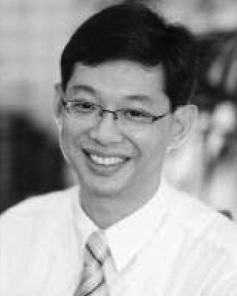

## Prof.Dugki Min

### Biography
Dugki Min received the B.S. degree in industrial engineering from Korea University, in 1986, and the M.S. and Ph.D. degrees in computer science from Michigan State University, in 1995. He is currently a Professor with the Department of Computer Science and Engineering, Konkuk University. His research interests include cloud computing, distributed and parallel processing, big data processing, intelligent processing, software architecture, and modeling and simulation.(Based on document published on 6 January 2019).

### Papers
__*A Hierarchical Modeling and Analysis Framework for Availability and Security Quantification of IoT Infrastructures Electronics 2020, 9(1), 155 2020*__ *IF 2.220 Electronics 2020, 9(1), 155, 2020, IF 2.220*

__*Reliability and Availability Evaluation for Cloud Data Center Networks Using Hierarchical Models*__ *IEEE Access ( Volume: 7 ) 2019 IF 4.098*

__*A stochastic reward net-based assessment of reliability, availability and operational cost for a software-defined network infrastructureThe Journal of Supercomputing*__ *vol 75, pages 4657– 4683)2019, IF 2.157*

### Contact
Office : Room 385, Engineering Building C
Lab : Room 1207, New Engineering Building
HP +82-2-450-33490 
E-Mail: dkmin@konkuk.ac.kr
